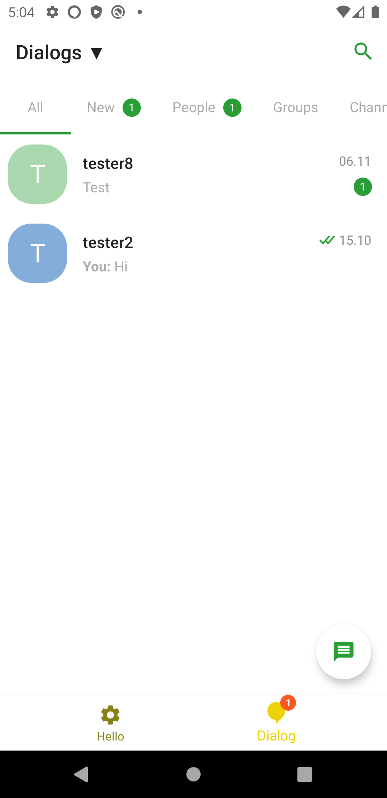
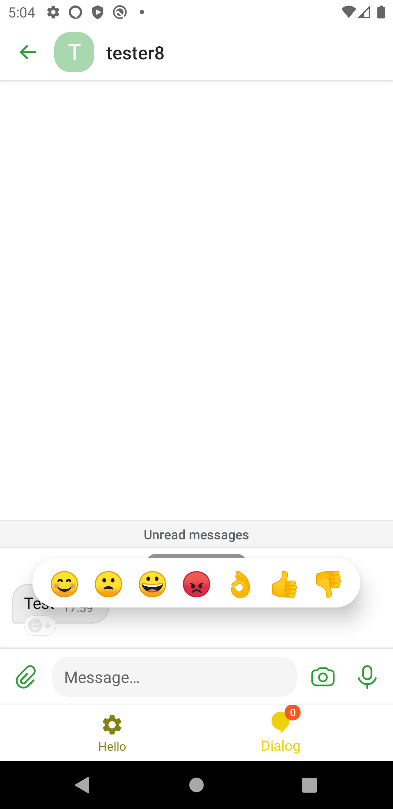
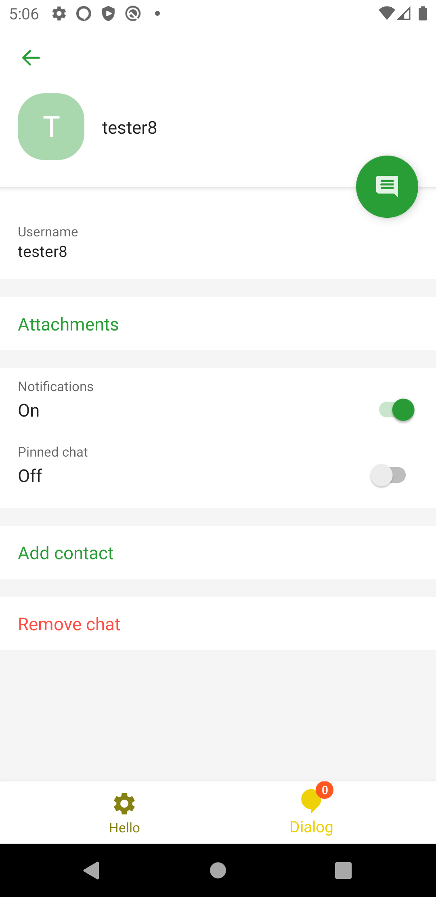

# oem-android
Demo Application to show how integrate Dialog SDK in your client.

&nbsp;
&nbsp;


# Work with Dialog SDK on the example of a _oem-android_:
## Integrate SDK

:exclamation: **DialogSdk should be initialised in one example for app.**

 - initialize **Dialog SDK** in [Application](app/src/main/java/ru/example/oem_test/OemTestApplication.kt)
```
override fun onCreate() {
    super.onCreate()
    sdk = DialogSdk(
        application = this,
        appName = getString(R.string.app_name),
        versionCode = BuildConfig.VERSION_CODE,
        versionName = BuildConfig.VERSION_NAME,
        fcmProjectId = getString(R.string.gcm_defaultSenderId).toLong(),
        host = TEST_HOST,
        port = TEST_PORT,
        deepLinkActivity = BASE_ACTIVITY::class.java,
    )
```
 - override methods in [Activity](app/src/main/java/ru/example/oem_test/OemTestActivity.kt)
```
override fun onCreate(savedInstanceState: Bundle?) {
    sdk.deepLinksResolver.onCreate(this, ::someAction) // someAction - optional
}
override fun onNewIntent(intent: Intent?) {
    super.onNewIntent(intent)
    setIntent(intent)
    sdk.deepLinksResolver.onNewIntent(intent, ::someAction)) // someAction - optional
}
override fun startActivity(intent: Intent?, options: Bundle?) {
    sdk.deepLinksResolver.onActivityStarted(
        intent,
        options,
        ::selectDialogsTab
    ) {
        super.startActivity(intent, options)
    }
}
override fun onDestroy() {
    super.onDestroy()
    sdk.deepLinksResolver.onDestroy()
}
override fun onBackPressed() {
    val currentFragment = // значение в котором хранится текущий корневой фрагмент
    if (currentFragment || !sdk.onBackPressed(currentFragment)) super.onBackPressed()
}
```
 - override [string resources](app/src/main/res/values/strings.xml)
```
<string name="app_secondary_deep_link_scheme" translatable="false">dialogOem</string>
<string name="app_primary_deep_link_host" translatable="false">ee.dlg.im</string>
```
## Integrate Push
 - generate **google-services.json** set with your project
 - create appropriate config on the server-side.
 - create class [**PushService**](app/src/main/java/ru/example/oem_test/PushService.kt) and call **sdk: DialogSdk** by Singleton/Application/DI/etc.
```
class PushService : FirebaseMessagingService() {
 
    override fun onMessageReceived(message: RemoteMessage) {
        super.onMessageReceived(message)
        sdk.pushConsumer.onMessageReceived(message, this)
    }
 
    override fun onNewToken(token: String) {
        super.onNewToken(token)
        sdk.pushConsumer.onNewToken(token, this)
    }
 
    override fun onDestroy() {
        super.onDestroy()
        sdk.pushConsumer.onDestroy(this)
    }
}
```
 - Add in [**AndroidManifest**](app/src/main/AndroidManifest.xml)
```
<service
    android:name="PACKAGE_NAME.PushService"
    android:exported="false">
    <intent-filter>
        <action android:name="com.google.firebase.MESSAGING_EVENT" />
        </intent-filter>
</service>
```

# Steps to integrate Dialog SDK in your project
## Gradle
### [Gradle App Module](build.gradle)
 - Add in plugins `apply plugin: 'com.google.gms.google-services'` in build.gradle(*whole project*)
 - Add in implementation `implementation "com.google.firebase:firebase-messaging:20.2.4"` in build.gradle(*whole project*)
 - Add in implementation `implementation("im.dlg:sdk:0+") { transitive = true }` 
 - Add in dependencies
```
buildscript {
    //
    dependencies {
        classpath 'com.google.gms:google-services:4.3.3'
    }
}
```

### [Gradle Project Module](app/build.gradle)
 - Add in repositories list
```
repositories {
  ...
  maven {
    url "https://external-nexus.dlg.im/nexus/repository/mvn-android/"
  }
}
```
